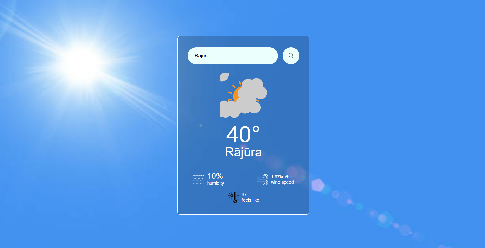
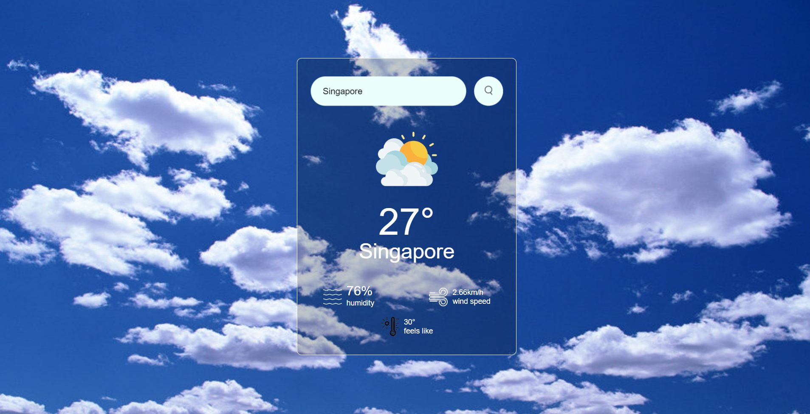

## ☁️ Weather App
- Experience weather like never before with our beautifully designed, user-friendly Weather App. Built with HTML, CSS, and JavaScript, this app offers a seamless interface and an engaging design that makes checking the weather a delightful experience.

## ⭕ Key Features

*   **🚀 Interactive Design:** Smooth transitions and visually appealing elements provide an intuitive and enjoyable experience.
*   **👽 Real-time Updates:** Stay informed with accurate, up-to-date weather data for your location.  
*   **💻 Rich Visuals:** Integrated high-quality images enhance the overall aesthetic, making the app visually captivating. 
*   **🤖 User-Centric Interface:** Designed with simplicity and functionality in mind, ensuring ease of navigation for all users.

## 🛠️ Technologies Used

*   **HTML:** Structures the content and layout of the Weather App.
*   **CSS:** Styles the application, creating the beautiful and responsive user interface.
*   **JavaScript:** Powers the app's functionality, including fetching weather data, updating the UI, and handling user interactions.  (Mention any libraries or frameworks used, e.g., "Uses the Fetch API for data retrieval.")

